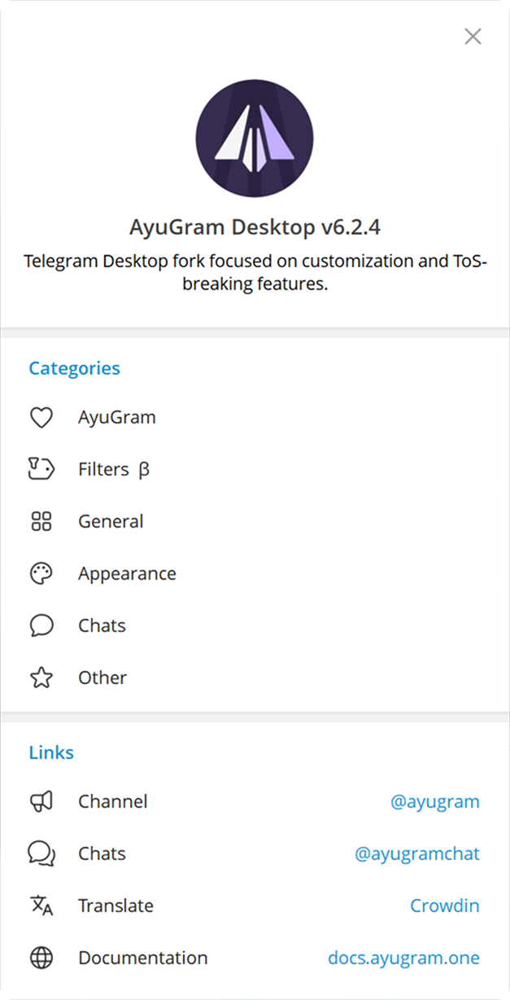
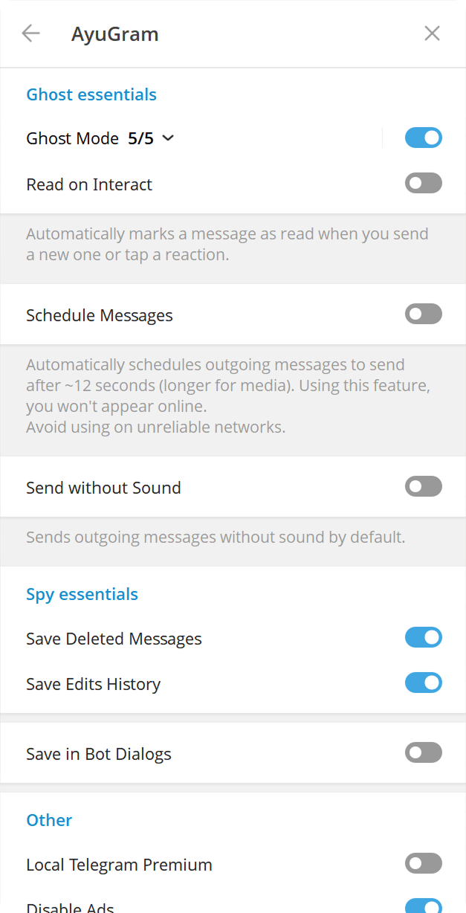
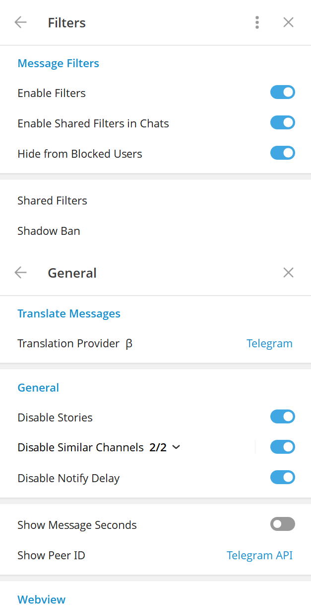
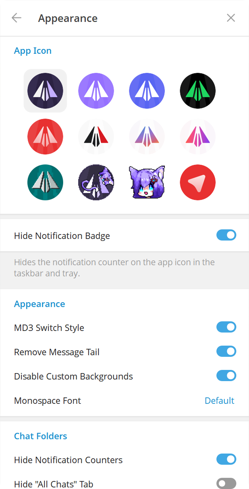
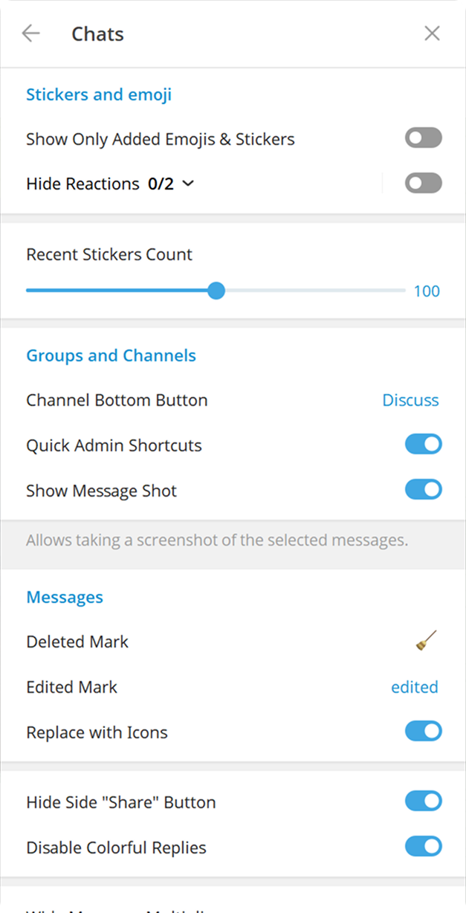

# DiveGram

 

[ English  |   [Русский](README-RU.md) ]

## Features

- Full ghost mode (flexible)
- Messages history
- Anti-recall
- Font customization
- Streamer mode
- Local Telegram Premium
- Translator
- Media preview & quick reaction on force click (macOS)
- Enhanced appearance

And many more. See [Releases](https://github.com/yak1tori/divegram-desktop-linux/releases/latest) for downloads.

<h3>
  <details>
    <summary>Preview</summary>
    <table>
      <tr>
        <td></td>
        <td></td>
        <td></td>
      </tr>
      <tr>
        <td></td>
        <td></td>
      </tr>
    </table>
  </details>
</h3>

## Downloads

This repository ships Linux builds for x86_64. All artifacts are published on the
[Releases page](https://github.com/yak1tori/divegram-desktop-linux/releases/latest).

| Format | File | Install |
|---|---|---|
| AppImage | `DiveGram-1.0.0-x86_64.AppImage` | `chmod +x` and run |
| Debian / Ubuntu | `divegram_1.0.0_amd64.deb` | `sudo apt install ./divegram_1.0.0_amd64.deb` |
| Fedora / openSUSE | `divegram-1.0.0.x86_64.rpm` | `sudo dnf install ./divegram-1.0.0.x86_64.rpm` |
| Arch Linux | `divegram-1.0.0-1-x86_64.pkg.tar.zst` | `sudo pacman -U ./divegram-1.0.0-1-x86_64.pkg.tar.zst` |
| Portable | `divegram-1.0.0-linux-x86_64.tar.xz` | extract and run `usr/bin/DiveGram` |

`PKGBUILD` is included in the release for AUR packaging. `CHECKSUMS.txt` contains
SHA-256 for every artifact.

### AppImage

```bash
chmod +x DiveGram-1.0.0-x86_64.AppImage
./DiveGram-1.0.0-x86_64.AppImage
```

No installation or root access required.

### Build from source

See [docs/building-linux.md](docs/building-linux.md). Submodules are required:

```bash
git clone --recursive https://github.com/yak1tori/divegram-desktop-linux.git
```

Other platforms are not maintained in this repository. Windows and macOS builds
are out of scope here.

## Credits

### Telegram clients

- [Telegram Desktop](https://github.com/telegramdesktop/tdesktop)
- [Kotatogram](https://github.com/kotatogram/kotatogram-desktop)
- [64Gram](https://github.com/TDesktop-x64/tdesktop)
- [Forkgram](https://github.com/forkgram/tdesktop)

### Libraries used

- [JSON for Modern C++](https://github.com/nlohmann/json)
- [SQLite](https://github.com/sqlite/sqlite)
- [sqlite_orm](https://github.com/fnc12/sqlite_orm)
- [androidx sources](https://github.com/androidx/androidx)

### Icons

- [Solar Icon Set](https://www.figma.com/community/file/1166831539721848736)

### Bots

- [TelegramDB](https://t.me/tgdatabase) for username lookup by ID (until closing free inline mode at 2 April 2026)
